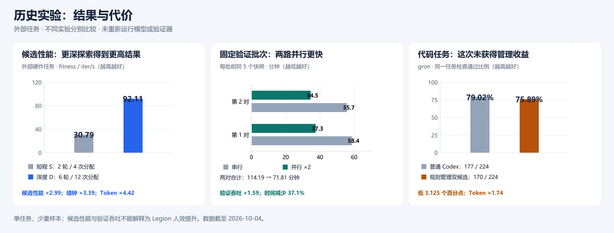

# Legion

**Agent management：给一个目标，组织多个 Worker 执行，检查证据，再继续或交付。**

Windows · Codex / Command Code · Apache-2.0

[快速开始](#快速开始) · [实验结果](#实验观察) · [架构](docs/architecture-boundaries.md) · [恢复任务](docs/resumable-engineering.md)

```text
目标与约束 → Manager 分配 → Workers 执行 → 检查与证据 → 继续 / 交付
```

研究目标是探索用更多 Token 换取更高质量与更少人工投入；**十倍人效尚未验证**。

## 快速开始

需要 **Node.js 22+** 和本机可用的 Codex 登录。

```sh
git clone --branch main https://github.com/lizaixi01/Legion.git
cd Legion
npm ci
npm run runtime:install  # 安装项目固定的 Codex CLI
npm run desktop
```

选择项目，输入目标；需要跨轮推进时开启“持续目标”。[Windows 安装包](https://github.com/lizaixi01/Legion/releases)与源码进度分别记录，本次更新未发布新安装器。

## 实验观察



这些是**历史外部任务**的结果。候选性能和验证吞吐分别衡量；单任务、小样本不证明普遍管理收益或人效提升。最新 Worker ×2 / ×4 对照因验证超时未完整，不能计算加速比。

[查看完整报告与失败记录](docs/research/experiment-summary.md) · [摘要数据与来源哈希](docs/research/results-20261004.json)

[CANN 实验结果与证据（2026-10-07）](docs/experiments/cann-results.md)：AddRmsNormBias 的已验证候选从 26.06 分到 28.87 分，五个历史版本均通过 15/15。另收录交付 A/B 审计和两个尚待真机验证的候选；分数变化不等于 Agent 效率或稳定性能提升。

## 当前边界

已支持任务委派、并发队列、显式持续目标与工程任务恢复。外部项目通过自己的说明、文件和命令使用 Legion。

通用功能认证目前限内置数值聚合验证器；工程入口重放批准的测试，其他功能覆盖不足时保持 `unverified`。Claude Code、关闭应用后常驻执行及多日可靠性尚未接入或验证。详见[主 Agent](docs/primary-agent.md)。

## 开发

```sh
npm run build      # 产品与桌面资源
npm test           # 离线行为回归
npm run typecheck
```

[开发计划](docs/benchmark-development-plan.md) · [离线验收](docs/offline-acceptance-20261004.md) · [隔离规则](docs/benchmark-safe-development.md) · [Apache-2.0](LICENSE)
