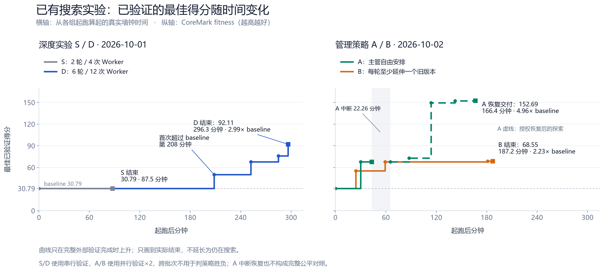
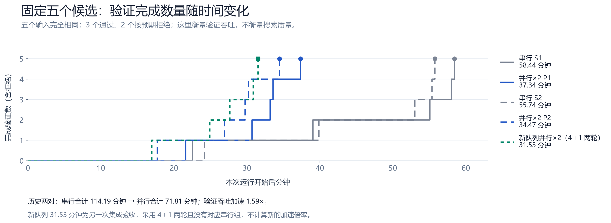

# Legion

**Legion 是一款 Multi-Agent 管理器，通过协调多个 Agent，探索用 1000 倍 Token 换取 10 倍效率与生产力。**

这是研究目标，尚未实测达成。我们关心的是：在基本不增加人的监督、决策、验收和返工时间的前提下，更多计算能否带来更多合格交付。

Legion 是现成执行器之上的持续管理层：围绕目标安排任务、并行探索、检查候选、保留证据，再决定继续、返工或结束。管理 Codex、Claude Code 等执行器是项目方向；**当前已接入 Codex 与 Command Code，尚未接入 Claude Code**。

## 它怎样工作

1. **给目标与约束**：选择项目、添加文件，说明要交付什么。
2. **安排多个 Worker**：Codex 主会话担任 Manager，在独立工作目录分配任务、读取结果并调整下一步。
3. **检查确定版本**：把候选交给外部验证器；执行结束或模型自评通过，都不能替代验收证据。
4. **继续或交付**：保留候选、失败、检查与决策记录；只有已安装验证器覆盖并通过的要求才能获得认证，覆盖不足时保持 `unverified`。

当前有普通聊天、显式持续目标、可恢复工程任务和 HWE 候选研究等入口，能力与验收范围仍有区别。详见[主 Agent](docs/primary-agent.md)与[架构边界](docs/architecture-boundaries.md)。

## 实验进展：目前的证据

以下来自 **2026-10-03 整理的固定 HWE RV32IM 实验**。搜索是单任务、每组一次运行；验证吞吐有两组历史配对。它们用于说明当前进展，尚不能推断一般任务的成功率或十倍人效。

### 更长搜索得到了更好的候选，也用了更多资源

[](docs/assets/hwe-experiments-20261003/outcomes-over-time.png)

*点击图片查看原图。左图比较搜索深度；右图 A 的虚线是中断恢复后的探索，不能据此判定策略胜负。*

| 搜索深度 | 短程 S | 深度 D |
|---|---:|---:|
| 最佳已验证 CoreMark fitness（越高越好） | 30.79 | **92.11** |
| 运行墙钟（分钟） | 87.48 | 296.32 |
| 输入＋输出 Token | 4,441,276 | 19,633,035 |

**D 的候选 fitness 是基线的 2.99 倍**，同时用了 S 的 **3.39 倍时间、4.42 倍 Token**。首次超过基线在 208.37 分钟；在 S 结束的 87.48 分钟内，D 也尚未超过基线。这衡量的是候选性能，不能解释为 Agent 工作速度提升。

管理策略探索中，恢复后的 A 得到 152.69，完整运行的 B 得到 68.55。A 经历中断与恢复，两组又都安排了 10 次旧候选延伸，实际分配差异有限，**目前不能公平宣布策略胜者**；S/D 与 A/B 的验证调度、冻结实现也不同，不能跨批次排名。

方法、最终复验和比较限制见[实验报告：成果随时间](docs/hwe-experiment-summary-20261003.md#1-成果随时间怎样提升)。

### 两路并行提高了固定候选的验证吞吐

[](docs/assets/hwe-experiments-20261003/validation-throughput.png)

*点击图片查看原图。每阶段输入相同，均为 3 个通过、2 个按预期拒绝；完成数量衡量验证吞吐。*

| 两组历史配对合计 | 串行 | 并行 ×2 |
|---|---:|---:|
| 完成同批候选的累计耗时（分钟） | 114.19 | 71.81 |

历史配对的**验证吞吐提高 1.59 倍，耗时减少 37.1%**，检查结论与指标一致。这是固定候选整批验证的收益，不是完整搜索的加速。

新产品队列另以 **31.53 分钟**完成 5 个候选（4＋1 两轮）；它没有对应串行对照，不能计算新队列的加速倍数。详见[实验报告：验证速度](docs/hwe-experiment-summary-20261003.md#2-验证速度有多快)。

### 这些结果的边界

- A/B 请求了 priority/Fast，但 **632 个完整可见响应均为 `default`，另 80 个响应档位未确认**；不能声称 Fast 已生效。
- 公开检查通过仅证明声明的覆盖范围，不等于穷尽正确性或实物 FPGA 性能；更高并发与其他任务的收益尚未验证。
- 此次公开的是[报告](docs/hwe-experiment-summary-20261003.md)、原图与[摘要数据及来源哈希](docs/results/hwe-experiments-20261003.json)，不含完整日志、冻结环境或 RTL 交付包。S/D 冻结实现为 `de04905` 并有已声明修正；A/B 快照还含当时未提交实现，当前 main 不是完整复现快照。

更早的 HWE 与 gron 对照、失败及成本口径见[公开实验摘要](docs/experiment-summary.md)。后续工程任务的[三臂协议](docs/three-arm-engineering-protocol.md)仍是计划，尚无已完成结果。

## 开始使用

### Windows 安装包

从 [Releases](https://github.com/lizaixi01/Legion/releases/latest) 下载 `Legion-Setup-*.exe`，安装后打开 Legion。安装时可选择桌面快捷方式；卸载保留 `%APPDATA%\Legion` 中的会话与运行记录。

安装包与 main 的开发进度可能不同；本文的能力说明以 **2026-10-03 的 main 源码**为准。

### 从源码运行

需要 **Node.js 22+** 和本机可用的 Codex 登录；沿用现有登录，不额外配置 API Key。

```sh
git clone https://github.com/lizaixi01/Legion.git
cd Legion
npm ci
npm run runtime:install  # 安装项目固定的 Codex CLI 0.159.2
npm run desktop         # 构建并打开桌面应用
```

选择项目、添加相关文件后输入目标；需要跨轮推进时开启“持续目标”。需要工程验收时，开启“工程任务”，先审核需求与测试，再执行；安全暂停后可在原任务恢复，限制见[恢复设计](docs/resumable-engineering.md)。

不调用模型的流程演示：`npm run demo`、`npm run demo:resume`。CLI 用法：`node bin/legion.cjs --help`；安装包用户也可通过 `legion` 打开桌面应用。

## 当前支持范围

| 能力 | 当前范围 |
|---|---|
| 执行器 | Codex 主会话；Codex / Command Code Worker。Command Code 的工具能力比 Codex 窄，Claude Code 尚未接入。 |
| 管理与继续 | 任务分配、并发队列、候选与决策记录、显式持续目标；可恢复工程任务有独立入口与条件。 |
| 验收 | 通用交付认证目前限内置数值聚合验证器；其他文件可获审查证据，功能覆盖不足仍未验证。工程入口重放批准的测试；HWE 使用已安装的固定领域检查。 |
| 仍待完成或验证 | 桌面观察、主动建议、关闭应用后常驻执行、多日可靠性、任意工程环境支持与跨后端 Token / 费用硬预算。 |

通用入口尚未强制识别所有需要登记交付契约的任务。Worker 候选主要使用复制目录与内容哈希，尚未统一为 Git worktree / commit 验收。隔离工作目录也不等于操作系统安全隔离。

## 开发与资料

```sh
npm run build       # 编译与生成桌面资源
npm test            # 行为测试
npm run dist        # Windows 安装包输出到 dist-release/
```

开发前阅读[架构边界](docs/architecture-boundaries.md)、[迭代计划](docs/benchmark-development-plan.md)与[实验期间的隔离规则](docs/benchmark-safe-development.md)。项目固定 runtime 位于 `.local/codex-runtime`；实验快照需记录运行时版本，不在冻结实验上原地升级。旧 Linux benchmark harness 有独立运行时配置。

## 许可证

Legion 原创代码与文档采用 [Apache License 2.0](LICENSE)。第三方依赖、CLI、benchmark 数据、任务仓库与工具链保留各自许可证。
