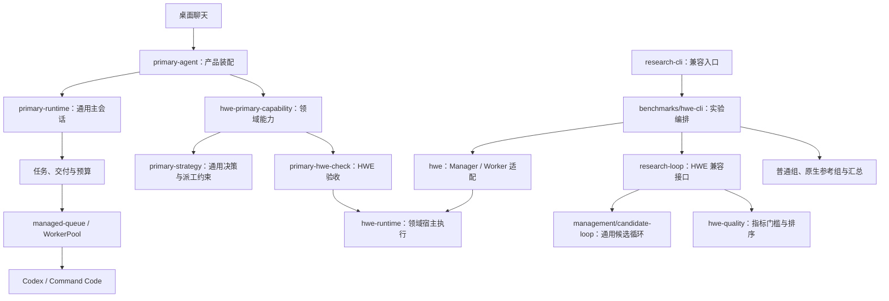

# 管理核心、任务环境与 benchmark 的边界

状态：第一轮源码解耦已实现。桌面主会话与候选研究循环仍是两条管理路径；本轮提取各自的通用接口，没有合并调度器，也没有运行模型 benchmark。

Legion 管理任务、资源、候选和证据。任务环境负责产物验收和质量比较，benchmark harness 在声明的实验条件下测量系统。HWE 的 formal、仿真、指标和 readiness 属于任务环境；A/B 组配置、跨组统计和实验报告属于评测层。

## 当前结构

产品默认在 `primary-agent` 装配已有 HWE 能力；调用 `primary-runtime` 可以不安装领域能力，也可以注入另一种宿主能力。能力由宿主提供，模型输出不能注册验证器或改写验收规则。

| 边界 | 当前实现 | 依赖约束 |
| --- | --- | --- |
| 候选管理核心 | [candidate-types](../src/management/candidate-types.ts)、[candidate-loop](../src/management/candidate-loop.ts)：状态、来源、资源、并行执行、限并发验证队列和恢复 | 不导入 HWE 或 benchmark；不解释 RTL、ISA、formal 或固定质量字段 |
| 主会话管理核心 | [primary-runtime](../src/primary-runtime.ts)、[primary-capability](../src/primary-capability.ts)、[primary-strategy](../src/primary-strategy.ts)：任务、交付、能力生命周期与证据约束 | 不导入 HWE 或 benchmark；领域工具、提示、证据兼容性和完成检查由宿主提供 |
| 执行基础设施 | 既有后端、队列、进程接口；[wsl-path](../src/wsl-path.ts)、[model_proxy.py](../scripts/runtime/model_proxy.py) | 路径转换与模型传输不归 ProgramBench；执行完成不能签发产物验收 |
| HWE 任务环境 | [hwe-quality](../src/hwe-quality.ts)、[hwe-runtime](../src/hwe-runtime.ts)、[hwe-primary-capability](../src/hwe-primary-capability.ts)，以及既有归档、指纹、证据分类与 Manager 上下文 | 解释 PREUNSAT、ALTOPS、固定 RV32IM 接口、指标和覆盖范围；沿用同一验证器 |
| benchmark harness | [benchmarks/hwe-cli](../src/benchmarks/hwe-cli.ts)、普通组、原生参考组和汇总模块 | 调用被测系统与任务环境；核心不反向导入实验编排或依赖实验组身份 |

HWE 的宿主执行模块不再引用 ProgramBench 的路径工具或模型代理。ProgramBench 现有入口仍可使用：路径导出保留兼容接口，代理准备步骤将共享代理实际文件复制到独立运行目录，旧代理路径保留转发脚本。冻结实验中已复制的文件不迁移、不改写。

## 契约与兼容性

**质量策略。** `QualityPolicy<M>` 提供稳定身份、指标有效性与比较方向，可补充领域基础设施异常判定。HWE 仍要求 fitness、fmax_mhz、lut4、cycles 四项有限且为正，并最大化 fitness。离线另一环境使用最小化 defects，零值合法；同一循环无需修改即可运行。

只有 verified、证据 PASS、无基础设施异常、具备快照且指标有效的候选进入排名。FAIL 与异常可以同时存在：候选仍被拒绝，原始诊断保留，运行停止继续派工。即使某个环境错误地同时返回 PASS 和基础设施异常，核心也不能将其选为 best。

**主会话能力。** 宿主提供工具、领域提示、调用路由、未完成工作、失败、最终证据检查和清理。核心拒绝工具名称冲突；必要工作未结束或选中证据失效时阻止完成。先停止新派工，再关闭任务与领域资源。HWE 指纹兼容性由 HWE issuer 提供，通用策略不自行解释环境字段。

**持久记录。** `research-loop.ts`、`primary-agent.ts`、`research-cli.ts` 和 `hwe.ts` 的原导出/入口保留兼容。HWE `state.json` 仍为 version 1，未重置轮数、Worker 配额、耗时、期限或持续目标账本。新候选运行额外写入 `quality-policy.json`，恢复前核对策略身份；缺少此文件的旧 HWE 运行仅由 HWE 兼容入口按原策略恢复。改动策略语义时宿主必须更换身份，不能复用同一 ID 静默改变目标。

**来源与认证。** 新实验实现清单包含新增核心、环境、CLI 及共享代理依赖。候选源码、父子 diff、Worker 报告和历史 PASS 只是带来源的资料，不能认证新版本。验证器指纹仍自然计算，旧 readiness 与历史证据不改写；实际运行继续遵守原认证要求。

## 候选验证队列（2026-10-02）

`concurrency` 仍约束每轮 Worker；独立的 `verificationConcurrency` 只接受 1 或 2。通用调用、旧配置和旧 version 1 状态缺少此字段均按 1；HWE CLI 的新建默认配置显式写 2。恢复时解析并比较有效配置（缺省等价于显式 1，JSON 键顺序不影响比较），保留保存的配置形态；显式 2 与缺省 1 互不兼容，必须在清理、写状态或派发前拒绝切换。

调度屏障为 Manager → 本轮所有 Worker 收尾 → 当前轮验证队列 → 所有验证收尾 → 下一轮 Manager。空位按分配顺序补派，不跨轮，也不与 Worker 重叠；baseline 仍由原任务环境加载。验证位置包含前后快照哈希核对、宿主验证调用和结果归类；并发上限不改变单次验证器或领域质量门槛。

每个结果绑定自己的不可变快照身份及独立目录。普通拒绝继续排队；工具错误、超时、哈希异常、无效指标或持久化错误停止未开始的验证，已开始的兄弟验证收尾并保留有效结果。外部取消和总时限会向运行中的验证传播 AbortSignal；取消后才返回的结果不会进入交付。核心仍保留同时存在的候选 FAIL 和基础设施 ERROR；额外宿主错误放入 `candidate.verification.error`，不覆盖已有原始 evidence。

每次选优按 baseline、候选分配顺序重新应用领域策略的严格比较；相同指标保留串行时较早的候选。候选数组与 Manager 记录顺序固定，事件允许按实际完成顺序追加。Worker 分配先持久化再执行，恢复把 working/verifying 标为 interrupted，不补发已消费的 Worker 或验证。待验证候选仍使用既有 verifying 状态，通过是否有 `verification.startedAt` 区分排队与已开始。

事件和状态快照在入写队列时固定，单写入链保持顺序；失败被记录并停止派发，后续收尾仍可尝试保存。全部并发 Promise 收尾后才执行本运行的 owner 清理和 ended 保存。`cleanup`、`persistenceErrors` 与原运行错误同时保留；若存储持续不可写，返回值仍报告失败，磁盘最终状态不能承诺已保存。CLI 使用内存中的最终结果生成摘要，避免将旧检查点当作本次结果。

候选记录 queuedAt/startedAt/endedAt、queueMs/durationMs；`verificationBatches` 记录每轮墙钟、执行时间之和、最大活动位置数和开始/结束数量。执行时间包括位置内的哈希检查与开始事件落盘，不含排队；`executionMsSum` 包含重叠，不能解释为墙钟。旧记录没有时序数据时摘要显示 null；不补造历史测量。

本次接入 research/HWE 候选路径。桌面 `primary-agent` / `primary-hwe-check` 的独立调度未接入本队列；其共用 HWE 宿主适配层仅补充保留宿主超时分类。普通组和原生参考组的调度也未改动。固定候选集成入口与验收方法见 [HWE 管理文档](hwe-management.md#固定候选的真实集成验收)，它复用当前候选循环与验证器，不调用模型。

持续目标账本目前已经使用通用 `worker/check` 类别，并没有将 HWE 写进账本类型。本轮保留既有每目标调用上限与未知调用处理，没有增加可任意扩展的资源系统。

## 验证与限制

[边界回归](../tests/management-boundaries.test.ts) 验证不同指标与排序方向、异常保留、恢复策略绑定、旧 HWE 记录兼容、无 HWE 资产的实际离线主会话协议、宿主工具调用与清理，以及未完成/失效证据阻止交付。导入图检查覆盖传递依赖，防止核心通过其他模块重新引入领域或 benchmark。

HWE 的本机路径、WSL/Docker 配置和工具链仍集中在 `hwe-runtime`，尚未实现跨机器自动安装。研究 CLI 的环境维护命令和实验命令仍共用一个兼容入口，但产品验收不依赖该入口。两条管理路径及其预算仍各自保留，是否合并需要另行依据执行语义决定。

本轮结构性回归不能证明 Manager 收益或新场景适用性；也没有扩大真实乘除法、建筑或建模验证覆盖。后续优化管理策略时，可以在这些边界之外冻结任务和评测条件，独立比较策略变化。

## HWE 模型传输与会话收尾（2026-10-03）

HWE 的 model/effort/tier 声明、CLI 实际发送和响应实际服务档分层记录。Manager 在宿主复用 action=worker，以 decisionSchema 区分角色；显式 Fast 为隔离 CODEX_HOME 冻结并校验官方模型目录。缺省仍不指定速度/目录；模型、effort 或 Fast 元数据不匹配时停止，不换模型、认证或计费。共享 model_proxy 属于执行基础设施，服务档观察不能成为候选验收证据。

共享代理每个 HTTP 请求至多一次出站尝试，区分本地生成状态、上游 HTTP、流中断和客户端关闭。已开始写响应头后不追加第二个 502；诊断记录请求关联、阶段、时长、字节、脱敏 errno/reason 和响应元数据，不保存认证头或请求正文。HWE 的 CLI HTTP/流重试均显式设 0，避免不确定执行状态被隐藏重放；ProgramBench 的 CLI 策略未改变，兼容入口仍使用该共享代理。

session_runner 以 turn.completed 判定会话交卷，实际进程退出、强制结束、预算耗尽、取消和传输失败另行保留。完成事件后最多 5 秒退出余量，随后冻结并导出，移除本 owner 的容器/代理。宿主取消先写取消文件，使 bridge 有机会导出，30 秒未收尾才强制终止；硬终止不承诺全部成果必然保存。大 stdin 不读取的管道阻塞也受截止控制。

此变更只修复执行和观察机制，Worker 自述仍不能认证产物。Manager 900 秒/宿主 1,500,000 毫秒、原轮次屏障、验证并发 2、快照哈希、质量排序与已消费恢复额度保留。短真实 Manager/Worker 和无模型容器故障注入已验收；最新响应头部分写入、压缩解析、完成后关闭及输入管道边界由离线行为测试覆盖。完整证据见 [运行链路报告](../.local/hwe-runtime-diagnostics-20261003-102325/report.md)。
