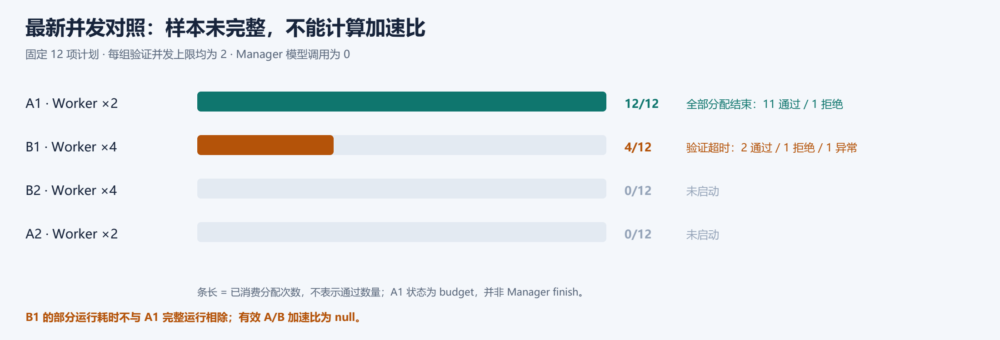

# 历史实验：结果、成本与比较范围

整理日期：2026-10-04。仅整理已有记录，没有启动新模型、验证器或 benchmark。这里发布外部项目实验的摘要与图表，不把其源码、领域工具或环境装入 Legion 产品。

## 已有观察

| 实验 | 观察 | 代价与结论范围 |
| --- | --- | --- |
| 外部硬件任务：短程 S / 深度 D | 最佳已验证 fitness：30.79 → 92.11，约 **2.99×** | 墙钟 **3.39×**、Token **4.42×**；这是候选性能，不能解释为 Agent 效率。 |
| 固定候选验证：串行 / 并行 ×2 | 两对合计 114.19 → 71.81 分钟，吞吐 **1.59×**，耗时减少 **37.1%** | 每批同一组 5 个快照；20 次结果语义与指标一致。不是整个搜索的加速比，也不归因于后来修改的队列。 |
| ProgramBench gron：普通 / 规则管理双候选 | 同一任务检查通过项：177/224 → 170/224，低 **3.125 个百分点** | 所列有效运行 Token **1.74×**、墙钟 365.1 → 505.3 秒；这次组合未获得收益。存在历史执行器差异。 |

三个实验分别回答候选质量、验证吞吐和单题成绩，不能把倍数合并为 Legion 效率。它们也不认证当前产品版本。

## 深度与资源

两组均从相同基线开始，使用 gpt-6.1-sol / xhigh、Worker 并发 2、串行验证和 6 小时上限。

| 项目 | 短程 S | 深度 D |
| --- | ---: | ---: |
| 轮次 / Worker 分配 | 2 / 4 | 6 / 12 |
| 运行墙钟 | 87.48 分钟 | 296.32 分钟 |
| 输入＋输出 Token | 4,441,276 | 19,633,035 |
| 最佳已验证 fitness（iter/s） | 30.79 | 92.11 |
| 首次超过基线 | 未出现 | 208.37 分钟 |

冻结实现为 `de04905`；两组共同应用已声明的 Manager 超时修正。D 在 S 的 87.48 分钟内也未超过基线。增加深度在这个案例中带来更高最终成果，尚不能证明普遍有效，也不是等资源比较。

## 固定验证批次

历史执行顺序为 S1 → P1 → P2 → S2。每批相同 5 个候选，均为 3 个通过、2 个正常拒绝；验证规则与单容器资源限额相同。

| 配对 | 串行 | 并行 ×2 | 加速比 |
| --- | ---: | ---: | ---: |
| S1 / P1 | 58.44 分钟 | 37.34 分钟 | 1.57× |
| S2 / P2 | 55.74 分钟 | 34.47 分钟 | 1.62× |
| 两对合计 | 114.19 分钟 | 71.81 分钟 | 1.59× |

合计使用原始秒数 **6,851.1 / 4,308.5** 计算，表格最后四舍五入；显示的分项分钟相加可能差 0.01 分钟。收益来自重叠执行，不代表每个候选都更快。后来的产品队列集成验收用 31.53 分钟完成 4＋1 两轮回放；没有同批串行组，不能计算新的加速比。

## 其他主要实验

| 实验 | 已记录结果 | 可以怎么解释 |
| --- | --- | --- |
| 外部硬件任务 batch-3：普通 / 管理组 | fitness 113.14 / 144.34，管理组高 27.58%；墙钟 34.33 / 60.24 分钟，增加 75.49% | 普通组 1 次 Worker；管理组 4 次 Worker＋2 次 Manager。不同总资源，尚未识别 Manager 的独立因果贡献。管理组以 `budget` 结束，非 Manager finish。 |
| 管理策略 A / B | A 故障后按原剩余额度恢复，最佳 152.69；B 完整运行最佳 68.55 | 恢复探索证据；**不能公平判胜**。A 日历墙钟 166.40 分钟，活动墙钟 144.15 分钟；B 为 187.25 分钟。 |
| 队列集成验收 | 5 个历史快照，3 通过 / 2 正常拒绝；观察最大验证并发 2 | 证明该批集成和收尾行为，不能视为新的配对性能成绩。 |
| 早期硬件 batch-1/2 | 尝试受到基础设施中断影响，未形成完整配对 | 保留故障，不能记为管理策略失败或补齐成成功结果。 |

gron 的修正成绩来自原有两份提交的重新评分，没有重新调用模型或选择候选。规则组是两个完整候选，并非 LLM Manager 自主分工。表中成本未包含首次超时且用量不完整的基线尝试，未知成本不能记成零。详见[冻结提交重评](../programbench-corrected-comparison.md)。

## 最新 Worker 并发对照

固定 12 项计划、每组验证并发上限 2、Manager 模型调用 0，预定顺序 A1 → B1 → B2 → A2。

| 组别 | Worker 并发 | 已消费分配 | 检查结果 | 状态 |
| --- | ---: | ---: | --- | --- |
| A1 | 2 | 12/12 | 11 通过 / 1 拒绝 | 全部分配结束；`budget` |
| B1 | 4 | 4/12 | 2 通过 / 1 拒绝 / 1 基础设施异常 | 验证超时；`error` |
| B2 | 4 | 0/12 | 未启动 | 未启动 |
| A2 | 2 | 0/12 | 未启动 | 未启动 |

A1 的主指标耗时为 180.94 分钟，B1 部分运行耗时为 89.67 分钟，口径均为首个 Worker 启动到最后一个候选验证结束。**两者不能相除得到加速比**；两对有效加速比均为 `null`。基础设施异常不计作候选正确性失败，后序组没有补跑。

## 覆盖与来源

这是主要批次的整理，不是一般成功率估计。独立本地索引覆盖 99 个目录，其中包括诊断、预检、离线回归和快照，不能当作 99 次正式实验。355 项 TypeScript 与 19 项 Python 回归属于工程验收，也不计入实验成绩。

硬件结果来自外部 HWE RV32IM 任务的公开检查：bounded ALTOPS formal、有限仿真和 FPGA 时序估计各有覆盖边界，不证明穷尽正确性或实物板卡性能。Token 为观测用量，不能直接当费用；尚未测量完整人工监督、维护和返工时间。请求 Fast 也不能据此认定实际 Fast 生效。

[机器可读摘要](results-20261004.json)列出指标、成本、配对资格、候选哈希及原始结果 SHA-256。数值核对原始文件与独立归档保全记录；原始档案保持只读。完整日志、认证、冻结运行时和候选包仍在本机，不随本次文档推送。

此前公开的[硬件实验摘要](https://github.com/lizaixi01/Legion/blob/a3468d7128d25cfacbfddc14b7d321ee79a5c154/docs/results/hwe-experiments-20261003.json)与[batch-3 报告](https://github.com/lizaixi01/Legion/blob/c1fa6150276058a7168fb1846e272aa39b804efe/docs/hwe-batch-3-comparison.md)保留在历史提交中；新图表由本次摘要数据重绘，未修改历史原图。

README 的呈现参考 [OpenHands](https://github.com/OpenHands/OpenHands/blob/main/README.md) 与 [CrewAI](https://github.com/crewAIInc/crewAI/blob/main/README.md) 的用途介绍、快速开始和文档导航结构；实验数值均来自 Legion 自身记录。
